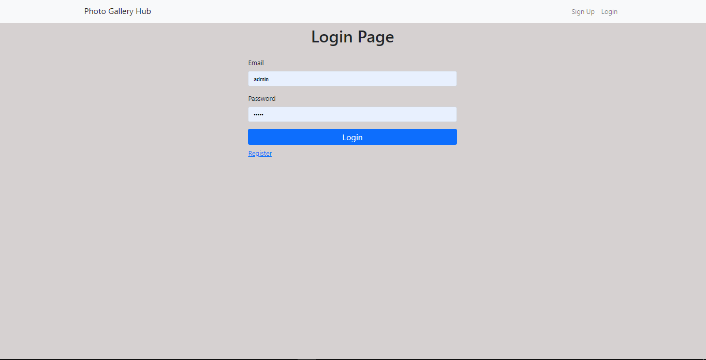

# Gallery Hub
A platform where Images are uploaded freely and each user has the access to manage their photos.

This project was created using Node.js, NestJs, PostgreSQL, and Bootstrap. Passport.js was used to handle authentication.
## Live demo [Gallery Hub](https://gallery-hub.herokuapp.com/)

> Login Details:
## email: admin@gmail.com
## password: admin

 
 > Registration page

 > Login Page

 > upload Photo

> Home page

 > Dashboard page

## Features
- Users can create, and remove their photos from the gallery
- User profiles include their gallery and the option to delete